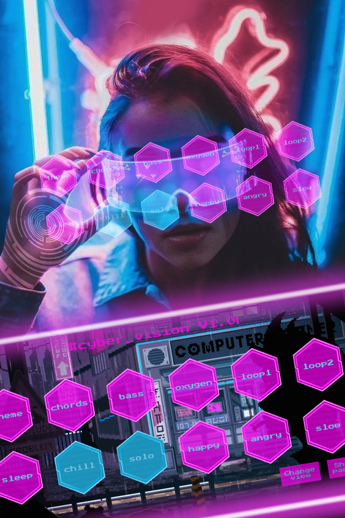

<h1 align="center">
<font color="#c930cb">#cyber_vision V1.0</font>
</h1>

||<font size="+2"><p align="left">Immerse yourself in the world of the future? It's real!</br> Thanks to this application, the world of the future can become closer, and your limitless imagination will make it the way you see it. Flying into space, cyberspace, robotics and other achievements of progress will sparkle with new colors in your head… </br></br>Listen to the future, imagine the future, create it!</p></font>|
|---|---|

## How To Use

To clone and run this application, you'll need [Git](https://git-scm.com) and [Flutter](https://flutter.dev/docs/get-started/install) installed on your computer. From your command line:

```bash
# Clone this repository
$ git clone https://github.com/Overman775/Cyber-Hack20.git

# Go into the repository
$ cd fluttery-todo

# Install dependencies
$ flutter packages get

# Run the app
$ flutter run
```

## Screenshots
<details>
  <summary>Screenshots</summary>

|  |
|---|
|  |

</details>

## License

```
MIT License

Copyright (c) 2020 Alexey Zdorovykh

Permission is hereby granted, free of charge, to any person obtaining a copy
of this software and associated documentation files (the "Software"), to deal
in the Software without restriction, including without limitation the rights
to use, copy, modify, merge, publish, distribute, sublicense, and/or sell
copies of the Software, and to permit persons to whom the Software is
furnished to do so, subject to the following conditions:

The above copyright notice and this permission notice shall be included in all
copies or substantial portions of the Software.

THE SOFTWARE IS PROVIDED "AS IS", WITHOUT WARRANTY OF ANY KIND, EXPRESS OR
IMPLIED, INCLUDING BUT NOT LIMITED TO THE WARRANTIES OF MERCHANTABILITY,
FITNESS FOR A PARTICULAR PURPOSE AND NONINFRINGEMENT. IN NO EVENT SHALL THE
AUTHORS OR COPYRIGHT HOLDERS BE LIABLE FOR ANY CLAIM, DAMAGES OR OTHER
LIABILITY, WHETHER IN AN ACTION OF CONTRACT, TORT OR OTHERWISE, ARISING FROM,
OUT OF OR IN CONNECTION WITH THE SOFTWARE OR THE USE OR OTHER DEALINGS IN THE
SOFTWARE.
```

## Contacts

> GitHub [@Overman775](https://github.com/Overman775) &nbsp;&middot;&nbsp;
> Telegram [@Overman775](https://t.me/Overman775) &nbsp;&middot;&nbsp;
> Linkedin [@Alexey Z](https://www.linkedin.com/in/overman775/) &nbsp;&middot;&nbsp;
> Twitter [@AlexeyZd](https://twitter.com/AlexeyZd)
